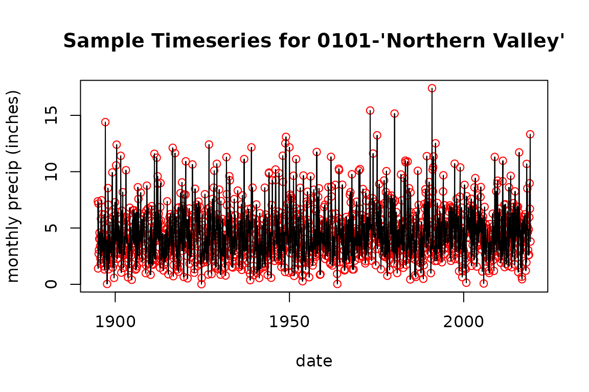
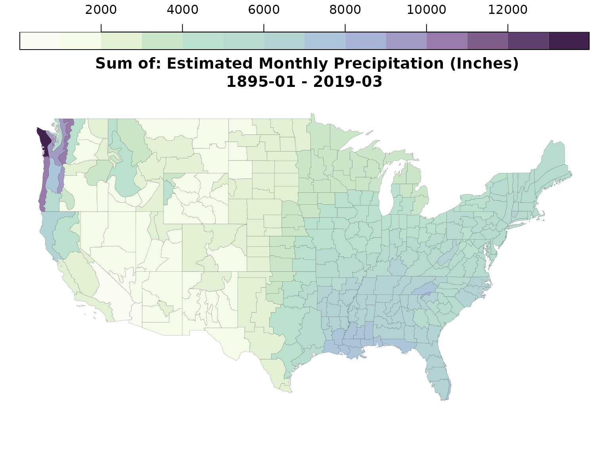

# NetCDF-CF Geometry and Timeseries Tools for R

## Introduction

`ncdfgeom` is intended to write spatial geometries, their attributes,
and timeseries data (that would typically be stored in two or more
files) into a single file. The package provides functions to read and
write the NetCDF-CF Discrete Sampling Geometries timeSeries feature type
as well as NetCDF-CF spatial geometries. These utilities are meant to be
general, but were designed to support working with typical geospatial
feature data with linked attributes and time series in NetCDF. Supported
data types include:

- Variables from R `data.frame` tables with one row per geometry are
  read from or written to NetCDF variables.
- `data.frame` tables with a time series per column are read from or
  written as NetCDF-CF DSG timeSeries FeatureType data.
- `sf` spatial point, line, and polygon types can be read from or
  written to NetCDF-CF geometry variables introduced in CF-1.8

For timeseries, two formats are supported:

1.  a wide format `data.frame` with timesteps in rows and geometry
    “instances” in columns with required attributes of geometry
    “instances” provided separately. This format lends its self to data
    where the same timestamps are used for every row and data exists for
    all geometry instances for all time steps – it is sometimes referred
    to as the orthogonal array, or “space-wide”, encoding.
2.  a long format `data.frame` where each row contains all the geometry
    “instance” metadata, a time stamp, and the variables to be stored
    for that time step. This format lends it self to data where each
    geometry instance has unique timesteps and/or data is not available
    for each geometry instance at the same timesteps (sparse arrays).

Additional read / write functions to include additional DSG feature
types will be implemented in the future and contributions are welcomed.
`ncdfgeom` is a work in progress. Please review the
[“issues”](https://github.com/DOI-USGS/ncdfgeom/issues) list to submit
issues and/or see what changes are planned.

## Installation

`ncdfgeom` is available from CRAN.

    install.packages("ncdfgeom")

The development version can be installed from GitHub.

    install.packages("remotes")
    remotes::install_github("DOI-USGS/ncdfgeom")

For this demo, we’ll use `sf`, `dplyr`, and `ncdfgeom`.

``` r

library(sf)
library(dplyr)
library(ncdfgeom)
```

## Sample Data

We will start with two dataframes: **`prcp_data` and `climdiv_poly`**
containing precipitation estimate timeseries and polygon geometries that
describe the boundaries of climate divisions respectively. The
precipitation data has one time series for each geometry.

Code to download and prep these data is shown at the bottom. More info
about the data can be found at:
[doi:10.7289/V5M32STR](https://doi.org/10.7289/V5M32STR)

The data required for this demo has been cached in the `ncdfgeom`
package and is available as shown below.

### `prcp_data`

``` r

prcp_data <- readRDS(system.file("extdata/climdiv-pcpndv.rds", package = "ncdfgeom"))
print(prcp_data, max_extra_cols = 0)
#> # A tibble: 1,491 × 345
#>    date       `0101` `0102` `0103` `0104` `0105` `0106` `0107` `0108` `0201`
#>    <date>      <dbl>  <dbl>  <dbl>  <dbl>  <dbl>  <dbl>  <dbl>  <dbl>  <dbl>
#>  1 1895-01-01   7.37   8.11   7.77   7.72   7.42   7.39   7.46   6.61   2.8 
#>  2 1895-02-01   1.41   2.37   2.27   2.72   2.94   2.85   2.97   3.65   0.8 
#>  3 1895-03-01   7.17   7.5    7.16   7.48   8.29   7.92   7.88   6.66   0.52
#>  4 1895-04-01   2.72   3.17   3.07   3.29   4.65   3.4    3.85   4.72   0.06
#>  5 1895-05-01   3.06   4.23   2.78   4.61   4.99   3.84   3.73   3.7    0.47
#>  6 1895-06-01   4.04   4.68   5.07   4.02   4.09   5.89   6.93  11.9    0.06
#>  7 1895-07-01   4.58   4.83   4.09   4.29   4.03   3.74   4.59   7.76   0.27
#>  8 1895-08-01   4      5.16   3.81   5.26   4.82   4.26   6.13   7.97   0.93
#>  9 1895-09-01   3.41   2.25   1.64   1.52   0.67   0.98   1.25   2.46   0.12
#> 10 1895-10-01   2.28   2.29   2.38   2.03   1.93   2.03   2.14   3.21   0.33
#> # ℹ 1,481 more rows
plot(prcp_data$date, prcp_data$`0101`, col = "red", 
     xlab = "date", ylab = "monthly precip (inches)", main = "Sample Timeseries for 0101-'Northern Valley'")
lines(prcp_data$date, prcp_data$`0101`)
```



### `climdiv_poly`

``` r

climdiv_poly <- read_sf(system.file("extdata/climdiv.gpkg", package = "ncdfgeom"))
print(climdiv_poly)
#> Simple feature collection with 344 features and 2 fields
#> Geometry type: MULTIPOLYGON
#> Dimension:     XY
#> Bounding box:  xmin: -124.7332 ymin: 24.54537 xmax: -66.9501 ymax: 49.38027
#> Geodetic CRS:  GRS 1980(IUGG, 1980)
#> # A tibble: 344 × 3
#>    CLIMDIV CLIMDIV_NAME                                                     geom
#>    <chr>   <chr>                                              <MULTIPOLYGON [°]>
#>  1 0101    NORTHERN VALLEY      (((-88.05783 35.00647, -86.31127 34.9911, -86.2…
#>  2 0102    APPALACHIAN MOUNTAIN (((-86.25819 34.99064, -85.60517 34.98468, -85.…
#>  3 0103    UPPER PLAINS         (((-88.0181 34.31526, -87.10991 34.2993, -87.11…
#>  4 0104    EASTERN VALLEY       (((-85.51167 34.51693, -85.39884 33.96413, -85.…
#>  5 0105    PIEDMONT PLATEAU     (((-85.40764 33.96421, -85.18459 32.86152, -85.…
#>  6 0106    PRAIRIE              (((-87.97935 32.30709, -88.42145 32.30868, -88.…
#>  7 0107    COASTAL PLAIN        (((-85.00105 32.51048, -84.99635 32.45474, -84.…
#>  8 0108    GULF                 (((-87.7888 31.29879, -87.71435 31.30213, -87.6…
#>  9 0201    NORTHWEST            (((-114.7559 36.08584, -114.6309 36.14248, -114…
#> 10 0202    NORTHEAST            (((-110.5007 37.00426, -109.0452 36.99909, -109…
#> # ℹ 334 more rows
plot(st_geometry(climdiv_poly), main = "Climate Divisions with 0101-'Northern Valley' Highlighted")
plot(st_geometry(filter(climdiv_poly, CLIMDIV == "0101")), col = "red", add = TRUE)
```


As shown above, we have two `data.frame`s. One has 344 columns and the
other 344 rows. These 344 climate divisions will be our “instance”
dimension when we write to NetCDF.

## Write Timeseries and Geometry to NetCDF

The NetCDF discrete sampling geometries timeseries standard requires
point lat/lon coordinate locations for timeseries data. In the code
below, we calculate these values and write the timeseries data to a
netcdf file.

``` r

climdiv_centroids <- climdiv_poly %>%
  st_transform(5070) %>% # Albers Equal Area
  st_set_agr("constant") %>%
  st_centroid() %>%
  st_transform(4269) %>% #NAD83 Lat/Lon
  st_coordinates() %>%
  as.data.frame()

nc_file <- "climdiv_prcp.nc"

prcp_dates <- prcp_data$date
prcp_data <- select(prcp_data, -date)
prcp_meta <- list(name = "climdiv_prcp_inches", 
                  long_name = "Estimated Monthly Precipitation (Inches)")

write_timeseries_dsg(nc_file = nc_file, 
                     instance_names = climdiv_poly$CLIMDIV, 
                     lats = climdiv_centroids$Y, 
                     lons = climdiv_centroids$X, 
                     times = prcp_dates, 
                     data = prcp_data, 
                     data_unit = rep("inches", (ncol(prcp_data) - 1)), 
                     data_prec = "float", 
                     data_metadata = prcp_meta, 
                     attributes = list(title = "Demonstation of ncdfgeom"), 
                     add_to_existing = FALSE)
#> [1] "climdiv_prcp.nc"

climdiv_poly <- st_sf(st_cast(climdiv_poly, "MULTIPOLYGON"))

write_geometry(nc_file = "climdiv_prcp.nc", 
               geom_data = climdiv_poly,
               variables = "climdiv_prcp_inches")
#> [1] "climdiv_prcp.nc"
```

Now we have a file with a structure as shown in the `ncdump` output
below.

``` r

try({ncdump <- system(paste("ncdump -h", nc_file), intern = TRUE)
cat(ncdump, sep = "\n")}, silent = TRUE)
```

For more information about the polygon and timeseries data structures
used here, see the [NetCDF-CF
standard.](https://cfconventions.org/cf-conventions/cf-conventions.html)

## Read Timeseries and Geometry from NetCDF

Now that we have all our data in a single file, we can read it back in.

``` r

# First read the timeseries.
prcp_data <- read_timeseries_dsg("climdiv_prcp.nc")
#> Warning in get_nc_list(nc, dsg, nc_meta, read_data): no altitude coordinate
#> found

# Now read the geometry.
climdiv_poly <- read_geometry("climdiv_prcp.nc")
```

Here’s what the data we read in looks like:

``` r

names(prcp_data)
#> [1] "time"              "lats"              "lons"             
#> [4] "alts"              "varmeta"           "data_unit"        
#> [7] "data_prec"         "data_frames"       "global_attributes"
class(prcp_data$time)
#> [1] "POSIXct" "POSIXt"
names(prcp_data$varmeta$climdiv_prcp_inches)
#> [1] "name"      "long_name"
prcp_data$data_unit
#> climdiv_prcp_inches 
#>            "inches"
prcp_data$data_prec
#> climdiv_prcp_inches 
#>          "NC_FLOAT"
str(names(prcp_data$data_frames$climdiv_prcp_inches))
#>  chr [1:344] "0101" "0102" "0103" "0104" "0105" "0106" "0107" "0108" "0201" ...
prcp_data$global_attributes
#> $nc_summary
#> named list()
#> 
#> $nc_date_created
#> named list()
#> 
#> $nc_creator_name
#> named list()
#> 
#> $nc_creator_email
#> named list()
#> 
#> $nc_project
#> named list()
#> 
#> $nc_proc_level
#> named list()
#> 
#> $nc_title
#> $nc_title$title
#> [1] "Demonstation of ncdfgeom"
names(climdiv_poly)
#> [1] "CLIMDIV"      "CLIMDIV_NAME" "geom"
```

To better understand what is actually in this file, let’s visualize the
data we just read. Below we join a sum of the precipitation timeseries
to the climate division polygons and plot them up.

``` r

climdiv_poly <- climdiv_poly %>%
  st_transform(3857) %>% # web mercator
  st_simplify(dTolerance = 5000)

title <- paste0("\n Sum of: ", prcp_data$varmeta$climdiv_prcp_inches$long_name, "\n", 
                format(prcp_data$time[1], 
                         "%Y-%m", tz = "UTC"), " - ", 
                format(prcp_data$time[length(prcp_data$time)], 
                         "%Y-%m", tz = "UTC"))

prcp_sum <- apply(prcp_data$data_frames$climdiv_prcp_inches, 
                  2, sum, na.rm = TRUE)

prcp <- data.frame(CLIMDIV = names(prcp_sum), 
                   prcp = as.numeric(prcp_sum), 
                   stringsAsFactors = FALSE) %>%
  right_join(climdiv_poly, by = "CLIMDIV") %>% 
  st_as_sf()

plot(prcp["prcp"], lwd = 0.1, pal = p_colors, 
     breaks = seq(0, 14000, 1000),
     main = title,
     key.pos = 3, key.length = lcm(20))
```



This is the code used to download and prep the precipitation and spatial
data. Provided for reproducibility and is not run here.

``` r

# Description here: ftp://ftp.ncdc.noaa.gov/pub/data/cirs/climdiv/divisional-readme.txt
prcp_url <- "ftp://ftp.ncdc.noaa.gov/pub/data/cirs/climdiv/climdiv-pcpndv-v1.0.0-20190408"

prcp_file <- "prcp.txt"

download.file(url = prcp_url, destfile = prcp_file, quiet = TRUE)

division_url <- "ftp://ftp.ncdc.noaa.gov/pub/data/cirs/climdiv/CONUS_CLIMATE_DIVISIONS.shp.zip"
division_file <- "CONUS_CLIMATE_DIVISIONS.shp.zip"

download.file(url = division_url, destfile = division_file, quiet = TRUE)
zip::unzip("CONUS_CLIMATE_DIVISIONS.shp.zip")

climdiv_poly <- read_sf("GIS.OFFICIAL_CLIM_DIVISIONS.shp") %>%
  select("CLIMDIV", CLIMDIV_NAME = "NAME") %>%
  mutate(CLIMDIV = ifelse(nchar(as.character(CLIMDIV)) == 3, 
                          paste0("0",as.character(CLIMDIV)),
                          as.character(CLIMDIV))) %>%
  st_simplify(dTolerance = 0.0125)

month_strings <- c("jan", "feb", "mar", "apr", "may", "jun", 
                   "jul", "aug", "sep", "oct", "nov", "dec")

prcp_data <- read.table(prcp_file, header = FALSE, 
                        colClasses = c("character", 
                                       rep("numeric", 12)),
                        col.names = c("meta", month_strings))

# Here we gather the data into a long format and prep it for ncdfgeom.
prcp_data <- prcp_data %>%
  gather(key = "month", value = "precip_inches", -meta) %>%
  mutate(climdiv = paste0(substr(meta, 1, 2), substr(meta, 3, 4)),
         year = substr(meta, 7, 10),
         precip_inches = ifelse(precip_inches < 0, NA, precip_inches)) %>%
  mutate(date = as.Date(paste0("01", "-", month, "-", year), 
                        format = "%d-%b-%Y")) %>%
  select(-meta, -month, -year) %>%
  filter(climdiv %in% climdiv_poly$CLIMDIV) %>%
  spread(key = "climdiv", value = "precip_inches") %>%
  filter(!is.na(`0101`))
  as_tibble()

# Now make sure things are in the same order.
climdiv_names <- names(prcp_data)[2:length(names(prcp_data))]
climdiv_row_order <- match(climdiv_names, climdiv_poly$CLIMDIV)
climdiv_poly <- climdiv_poly[climdiv_row_order, ]

sf::write_sf(climdiv_poly, "climdiv.gpkg")
saveRDS(prcp_data, "climdiv-pcpndv.rds")

unlink("GIS*")
unlink("CONUS_CLIMATE_DIVISIONS.shp.zip")
unlink("prcp.txt")
```

Here’s the `p_colors` function used in plotting above.

``` r

p_colors <- function (n, name = c("precip_colors")) {
# Thanks! https://quantdev.ssri.psu.edu/tutorials/generating-custom-color-palette-function-r
    p_rgb <- col2rgb(c("#FAFBF3", "#F0F8E3", "#D4E9CA", 
                       "#BBE0CE", "#B7DAD0", "#B0CCD7", 
                       "#A9B8D7", "#A297C2", "#8F6F9E", 
                       "#684A77", "#41234D"))
    precip_colors = rgb(p_rgb[1,],p_rgb[2,],p_rgb[3,],maxColorValue = 255)
    name = match.arg(name)
    orig = eval(parse(text = name))
    rgb = t(col2rgb(orig))
    temp = matrix(NA, ncol = 3, nrow = n)
    x = seq(0, 1, , length(orig))
    xg = seq(0, 1, , n)
    for (k in 1:3) {
        hold = spline(x, rgb[, k], n = n)$y
        hold[hold < 0] = 0
        hold[hold > 255] = 255
        temp[, k] = round(hold)
    }
    palette = rgb(temp[, 1], temp[, 2], temp[, 3], maxColorValue = 255)
    palette
}
```
